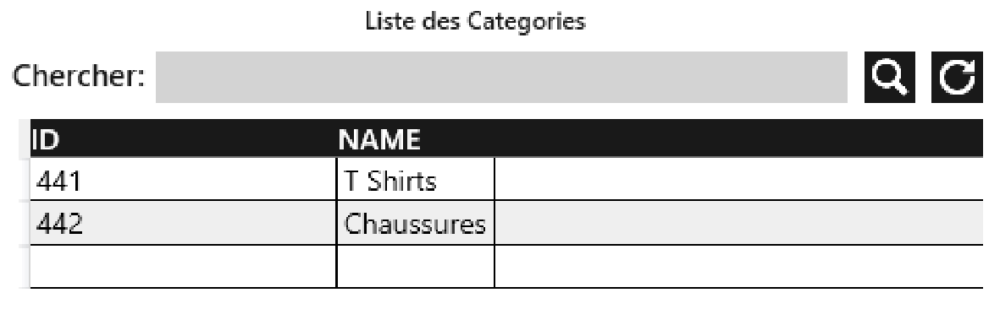

# Management App WPF .net framework 4.8.1 C#

Management App as part of a college project, made using intelliJ Rider in case that changes anything.
was at first a WinForms app but then changed to WPF, that's the reason why grids are not used in organizing the ui.
The UI and most of the code naming is in French.

The App connects to an oracle xe 11.2g database, using OracleConnection Library?, the whole stack is deprecated.
first ever project using these technologies.

# Preview of all the windows, tabs and features:

|preview of|image preview|
|----|---------------------------|
|tabs||
|search||
|status||
|login||
|categories||
|products||
|orders||
|clients||
|reviews||
|contact||
|admins||
|superadmin view of admins||
|admin signup||
